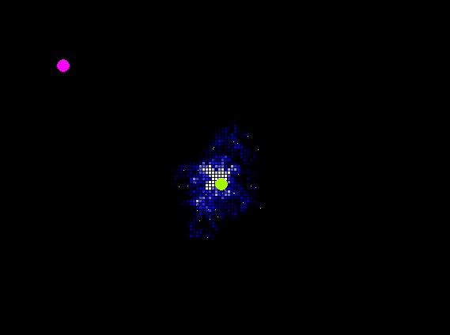

# AntSimp
A __stigmergy__ simulator made in Python using `pygame`.

### Milestones

- [x] Build system
- [x] Grid building
- [x] Adding the ants
- [ ] Ant AI
- [x] Visible feedback of the search field 
- [ ] User input for nest/food position 
- [ ] Walls

## Description
This is extremely barebones ant simulator.

> :warning: __This project is under development!!!__: also if someone wants to help me fix this thing he/she will be very much welcome to...

### Screenshots


### Troubleshooting
A quick fix for the error `libGL error: MESA-LOADER: failed to open iris`. Just run this bash command:
```bash
cp ~/anaconda3/lib/libstdc++.so.6 ~/libstdc++.so.6
```